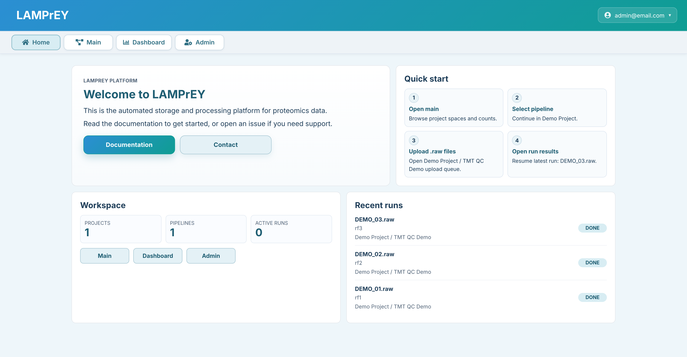

# LAMPrEY

LAMPrEY is a Docker-based quality control pipeline server for quantitative proteomics. It combines automated RAW file processing, an admin interface for pipelines and projects, an interactive dashboard, and an authenticated API.



Full documentation: [LewisResearchGroup.github.io/ProteomicsQC](https://LewisResearchGroup.github.io/ProteomicsQC/)

## Requirements

- Docker Engine
- Docker Compose, either `docker-compose` or `docker compose`
- `make`

## Quick Start

Clone the repository:

```bash
git clone git@github.com:LewisResearchGroup/ProteomicsQC.git ProteomicsQC
cd ProteomicsQC
```

Generate the local configuration:

```bash
./scripts/generate_config.sh
```

Run the first-time setup:

```bash
make init
```

If the published image is unavailable, use the local-build fallback:

```bash
make init-local
```

Start the application:

```bash
make devel   # development server on http://127.0.0.1:8000
make serve   # production-style server on http://localhost:8080
```

## What `make init` Does

`make init` performs the first-time setup using the published container image:

- runs migrations
- prompts for a Django superuser
- collects static files
- bootstraps demo data

`make init-local` performs the same setup, but builds the image locally with `docker-compose-develop.yml`.

## Common Commands

```bash
make devel         # start the development stack
make devel-build   # rebuild and start the development stack
make serve         # start the production-style stack
make down          # stop containers
make test          # run tests
```

## Notes

- Generated configuration is stored in `.env`.
- Local persistent data is stored under `./data/`.
- The admin panel is available at `/admin` after startup.
- For full installation, admin, API, and usage instructions, see the documentation site.
