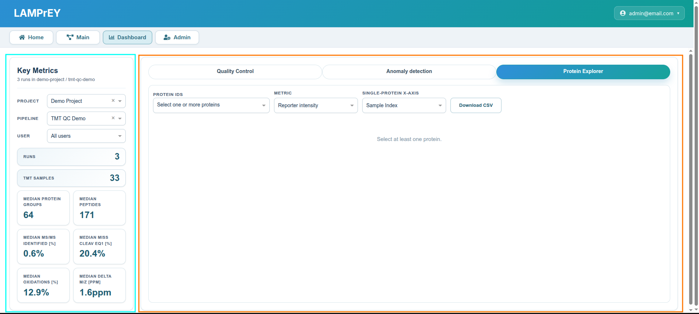
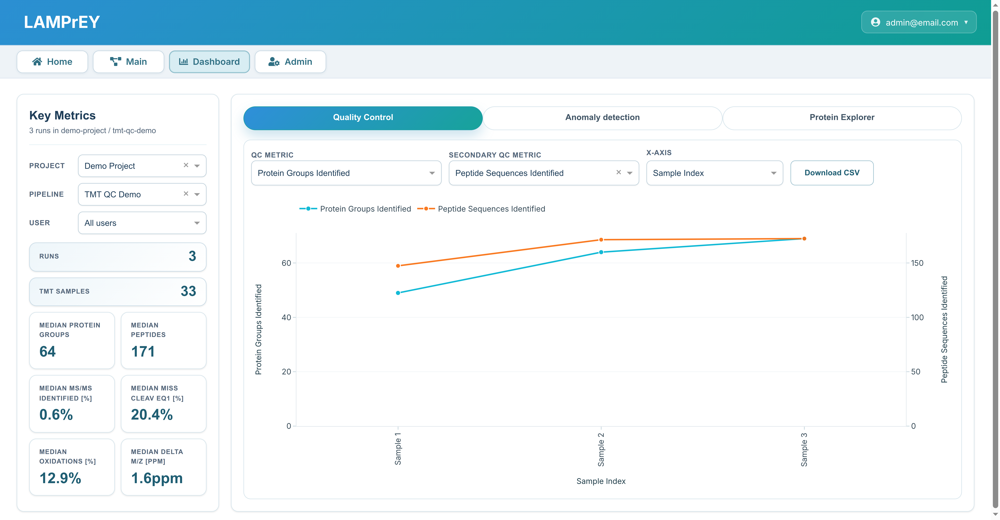
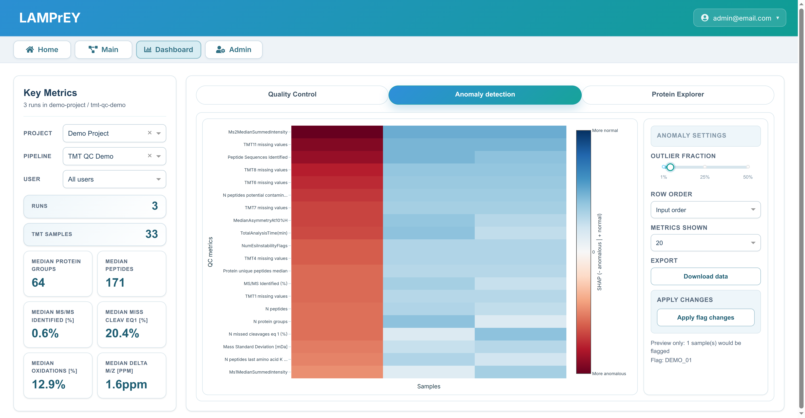
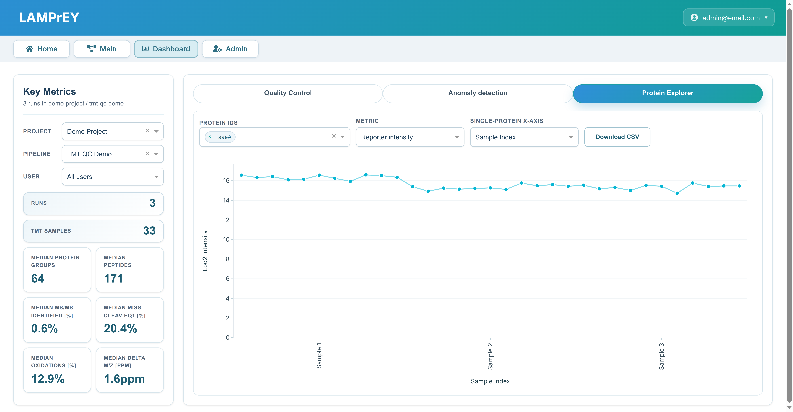
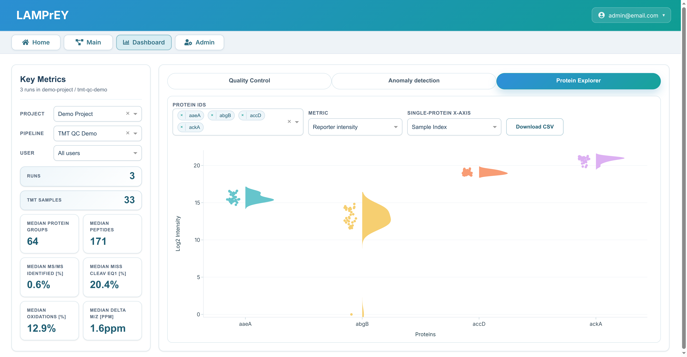

# Dashboard

The **Dashboard** section provides the cross-run analytical view of a pipeline. It is optimized for comparison, trend analysis, QC review, and anomaly inspection across many runs.

The Dashboard consists of two panels:

- The left panel includes summary stats for the runs contained within the selected pipeline.
- The right panel includes the working area with three tabs: QC Plots, Anomaly detection, and Protein explorer.

## Dashboard tabs

The Dashboard includes three tabs for different analytical perspectives:

!!! note ""

    === "Quality Control"
        The Quality Control tab allows users to review and compare QC metrics across different runs.

        Users can choose the primary QC metric, optionally add a secondary metric on a second y-axis, and switch the x-axis between run index, sample name, and acquisition date depending on the comparison they want to make. The tab also includes a CSV export so the currently scoped QC data can be downloaded for further analysis outside the application.

        

    === "Anomaly Detection"
        The Anomaly Detection tab provides tools for identifying and analyzing anomalies in the data.

        This tab lets users control the anomaly workflow by selecting the expected outlier fraction (5% default). The resulting view combines anomaly scores, a heatmap of metric-level contributions, and SHAP-based explanations to show which features drove each flagged run. Users can also download the anomaly table and apply the proposed flagging changes back to the pipeline. At a high level, the algorithm looks for runs that deviate from the overall multivariate QC pattern rather than from a single metric alone.

        

    === "Protein Explorer"
        The Protein Explorer tab offers an interactive interface for exploring protein-level data across runs. It supports both single-protein and multi-protein views. The single view is useful for closely inspecting one target across runs
        
        

        The multi view, on the other hand, is better for comparing several proteins at once and looking for shared or contrasting abundance patterns.

        
