# Main

The **Main** section is the operational entry point for day-to-day work in LAMPrEY.

It is where users move through the project and pipeline hierarchy, submit new RAW files, and open run-level results.

## What Main includes

The Main area covers three connected views:

1. the **Projects** page
2. the **Project detail** page with its pipeline list
3. the **Pipeline detail** page with uploads and run monitoring

Together, these pages provide the application flow from project organization to individual run inspection.

### Projects

The Projects page is the top-level workspace overview.

From here, users can:

- search and filter projects
- review project descriptions and activity
- see counts for pipelines, raw files, members, and active runs
- open a project to continue into its pipelines

Use this page when you want to answer: "Which project should I work in next?"

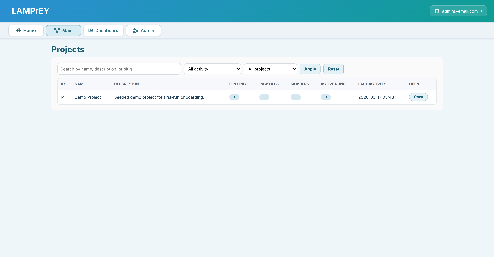

### Pipelines

Inside a project, the Pipelines page shows the pipelines contained within this project.

From here, users can:

- review project metadata
- search and filter pipelines
- inspect how many raw files each pipeline contains
- see flagged and downstream counts
- open the pipeline they want to work with

Use this page when you want to answer: "Which pipeline contains the runs I need?"

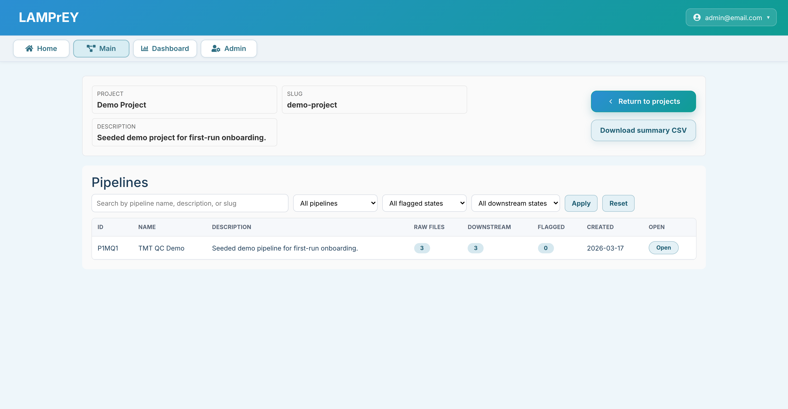

### Uploads

The Uploads page is the operational center for a specific pipeline.

It combines:

- the upload area for new `.raw` files
- the upload queue and progress state
- the run table with overall and stage-specific statuses
- actions such as opening, requeueing, cancelling, or deleting runs

Use this page when you want to:

- submit new files
- monitor processing
- reopen previous runs
- troubleshoot run state

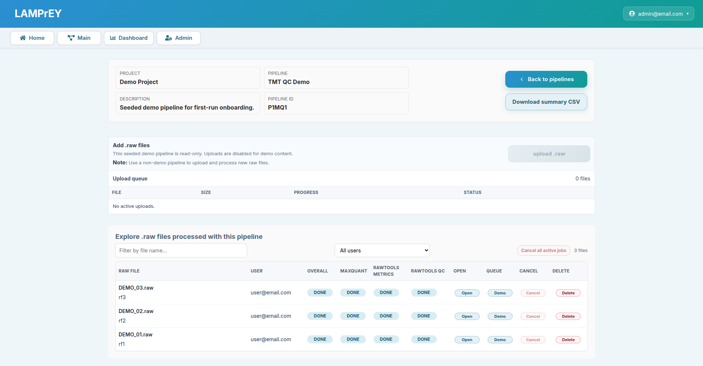

### Results

The Results page includes the detail view for each run.

Here the user can:

- inspect the run detail page
- review the generated MaxQuant and RawTools outputs

!!! note ""

    === "Run details"

        This is the top-level summary for one processed run. It combines processing status, key summary metrics, and the figure sections generated from RawTools and MaxQuant outputs.

        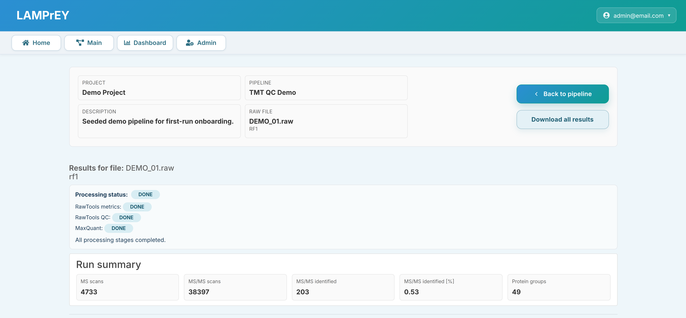

    === "MS TIC Chromatogram"

        The MS TIC chromatogram shows total ion current over retention time for MS1 scans. Use it to check overall signal shape, peak density, and large drops or spikes across the acquisition.

        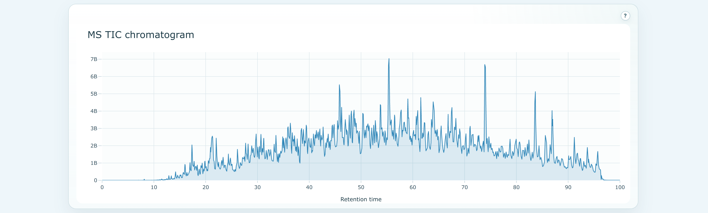

    === "MS2 TIC Chromatogram"

        The MS2 TIC chromatogram shows total ion current over retention time for MS2 scans. It helps confirm whether fragmentation activity follows the expected pattern across the run.

        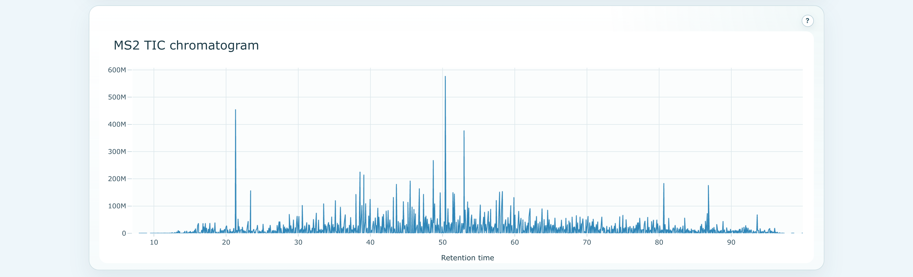

    === "Missed cleavages & Charge states"

        These stacked summaries show digestion and precursor-state behavior at a glance. They are useful for spotting unusual cleavage efficiency or an unexpected charge-state distribution.

        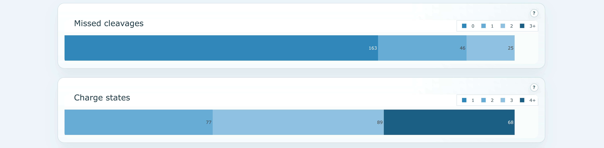

    === "Peptide length distribution"

        This plot shows the distribution of identified peptide lengths. It helps assess whether the observed peptide population looks biologically and technically reasonable for the experiment.

        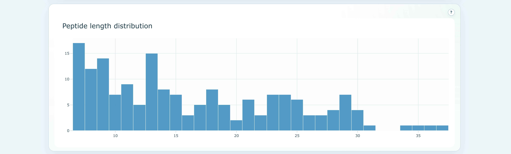

    === "Peptides per protein distribution"

        This figure summarizes how many peptides support each protein group. It gives a quick sense of identification depth and how strongly proteins are supported by the search results.

        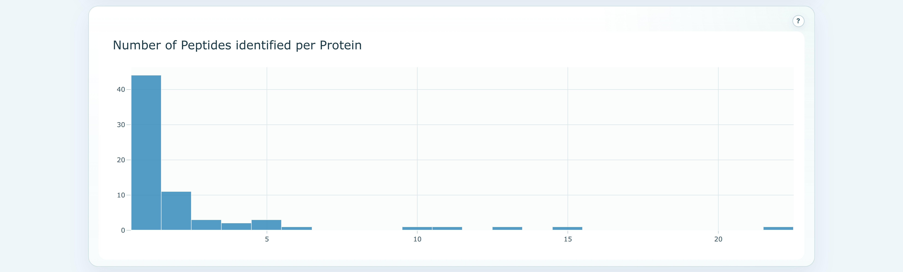

    === "Andromeda score distribution"

        The Andromeda score distribution shows the score spread of peptide-spectrum matches. Use it to judge whether identifications cluster in a strong confidence range or appear broadly weak.

        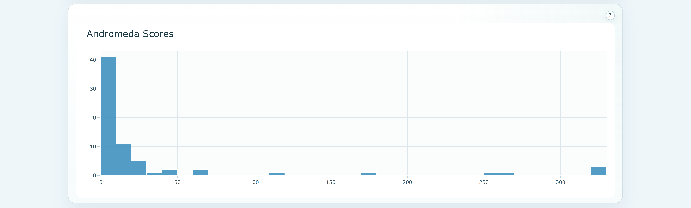

    === "Calibration plot"

        This plot summarizes mass calibration error after processing. It is helpful for checking whether mass accuracy is centered and stable rather than broadly shifted or dispersed.

        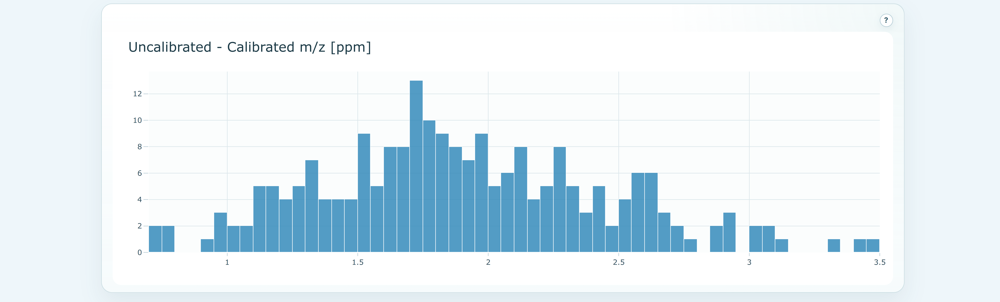

    === "Quantification plot"

        This figure summarizes the quantification signal available for the run. It helps confirm that reporter or intensity-based quantification produced the expected overall pattern.

        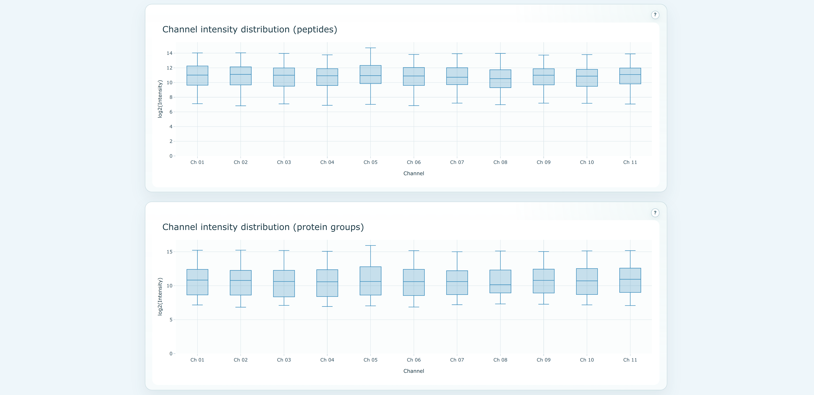

Use this page when you want to review the outputs of a specific run.

## Relationship to the admin panel

The Main section is for using configured projects and pipelines.

The **Admin panel** is where administrators create and configure the resources that Main depends on, such as:

- users
- projects
- pipelines
- pipeline inputs such as `mqpar.xml`

If you need to understand how those resources are created, see the [Admin panel](how-to-access-the-admin-panel.md) section and its child pages.
